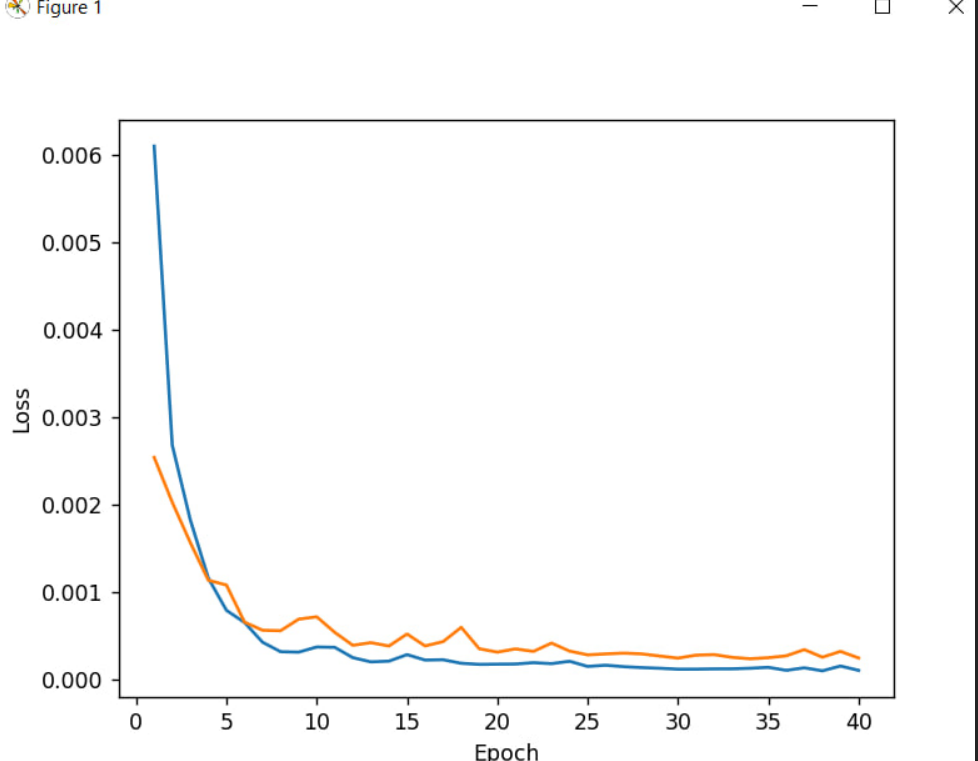

# BANKNOTE UNIQUE CODE RECOGNITION

</img>

<p align='center'>
  
  
  
  
</p>

## OVERVIEW

The application is supposed to capture region of interest(**ROI**) with unique banknote id, which consists of two letters and seven numbers(0-9), and implement **OCR** on it in order to recognize id, so it would be possible to operate with this code in future.

In this project Russian currency is used as an example of work(one, two and five thousands of rubles).

>[!IMPORTANT] Project has not been COMPLETED yet. At the moment app isn't working correctly, only 67% of planned functions are included. The app doesn't have properly working ocr.

### PROBLEM PROJECT SOLVES

The main problem that this application solves is the theft of banknotes. If your money has been stolen and you have the id of each bill, then you can provide these numbers to the police, which will greatly increase the chance of returning your lost money to your pocket.

## APP ARCHITECTURE

### CREATING OBJECT DETECTION MODEL TO CAPTURE REGION OF INTEREST

First it's required to detect roi, because OCR needs to see only the text we're interested in without any other distracting characters and signs. Bills are type of things that doesn't have a lot of different patterns(1000 of rubles looks like the other million of 1000 ruble bill and so forth). So, it would be really difficult to teach model on such little pattern as text(our id), especially if we resize banknote pics to the size of 170x128. 

And it was decided to teach the model to detect whole banknote and slice this region the way to get ~1/4 of right up part of banknote(where id is located).

> [!NOTE]Check pic below, where blue region is object's annotation and red is the piece with id, obtained by cropping the image.

</img>

#### ANNOTATON PROCESS

label-studio was used to annotate the samples. Out of 904 available samples only 860 were suitable.

#### MODEL ARCHITECTURE

VGG-16 is used as foundation to experiment with. Activation function of output layer was changed from softmax to sigmoid, also last layer contains 4 neurons, because model will predict 4 metrics: top left x, top left y, down right x, down right y. Input shape was changed.

Deep learning part was fine-tuned, so it has a bit different architecture. Categorical cross-entropy loss function was changed to MSE, because we have regression task now, not classification.

<p align='center'>
</img>
</p>

#### LEARNING CURVES
<p align='center'>
</img>
</p>

It's easy to see, that's model is working not quite well. Training loss is higher than test and there's huge gap between them. It indicates that the model is overfitting. **So, it's the problem is being solved now.**

With many tries and different architectures this is the best result this project ever had at the moment.

## PROBLEMS ENCOUNTERED IN THE PROCESS

### RELATIVE COORDINATES

There was no any idea how to work with relative coordinates. It was needed to transform absolute coords to relative, because the model is using sigmoid activation function, where it ranges from 0 to 1.

**It was solved by** dividing each coordinate by appropriate shape. Here's function, which transfrom these coordinates.

```python
def relative_coords(bbox):
  bbox = [bbox[0] / cols,#top_x
          bbox[1] / rows,#top_y
          bbox[2] / cols,#top_x
          bbox[3] / rows]#top_y
  
  return bbox
```

### NOT ENOUGH DATA

First versions of model were overfitting a lot more. All of that because there're were only 860 data samples.

**It was partly solved by** implementing augmentation. Best result of all augmentation types was shown by cut-out aug. It decreased overfitting in around two times.